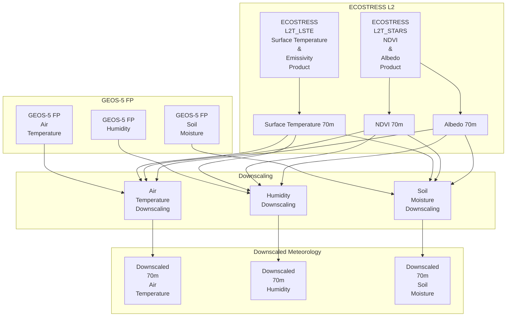
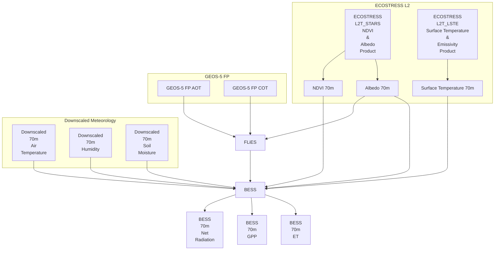

# ECOSTRESS Level 3 Evapotranspiration, Evaporative Stress Index, Water Use Efficiency

This is the main repository for the ECOsystem Spaceborne Thermal Radiometer Experiment on Space Station (ECOSTRESS) collection 3 level 3/4 evapotranspiration data products algorithm.

The ECOSTRESS collection 3 level 3/4 evapotranspiration data products algorithm is the pre-cursor to the [Surface Biology and Geology (SBG) collection 1 level 4 evapotranspiration data products algorithm](https://github.com/sbg-tir/SBG-TIR-L4-JET).

[Gregory H. Halverson](https://github.com/gregory-halverson-jpl) (they/them)<br>
[gregory.h.halverson@jpl.nasa.gov](mailto:gregory.h.halverson@jpl.nasa.gov)<br>
NASA Jet Propulsion Laboratory 329G

[Kerry Cawse-Nicholson](https://github.com/kcawse) (she/her)<br>
[kerry-anne.cawse-nicholson@jpl.nasa.gov](mailto:kerry-anne.cawse-nicholson@jpl.nasa.gov)<br>
NASA Jet Propulsion Laboratory 329G

[Madeleine Pascolini-Campbell](https://github.com/madeleinepc) (she/her)<br>
[madeleine.a.pascolini-campbell@jpl.nasa.gov](mailto:madeleine.a.pascolini-campbell@jpl.nasa.gov)<br>
NASA Jet Propulsion Laboratory 329F

[Claire Villanueva-Weeks](https://github.com/clairesvw) (she/her)<br>
[claire.s.villanueva-weeks@jpl.nasa.gov](mailto:claire.s.villanueva-weeks@jpl.nasa.gov)<br>
NASA Jet Propulsion Laboratory 329G

The code for the ECOSTRESS level 3 JET PGE will be developed using open-science practices based on the [ECOSTRESS collection 2 gridded and tiled product generation software](https://github.com/ECOSTRESS-Collection-2/ECOSTRESS-Collection-2) pending New Technology Report (NTR) and open-source license from NASA Jet Propulsion Laboratory.

The repositories for the evapotranspiration algorithms are located in the [JPL-Evapotranspiration-Algorithms](https://github.com/JPL-Evapotranspiration-Algorithms) organization.

## 1. Introduction 

This software will produce estimates of:
- evapotranspiration (ET)
- evaporative stress index (ESI)
- water use efficiency (WUE)

Evapotranspiration (ET) is one of the main science outputs from the ECOSTRESS mission. ET is a Level-3 (L3) product constructed from a combination of the ECOSTRESS Level-2 (L2) Land Surface Temperature & Emissivity (LSTE) product and auxiliary data sources. Accurate modelling of ET requires consideration of many environmental and biological controls including: solar radiation, the atmospheric water vapor deficit, soil water availability, vegetation physiology and phenology (Brutsaert, 1982; Monteith, 1965; Penman, 1948). Scientists develop models that ingest global satellite observations to capture these environmental and biological controls on ET. LST holds the unique ability to capture when and where plants experience stress, as observed by elevated temperatures which can idenitfy areas that have a reduced capacity to evaporate or transpire water to the atmosphere (Allen et al., 2007). The ECOSTRESS evapotranspiration product combines the [surface temperature and emissivity observations from the ECOSTRESS sensor](https://github.com/ECOSTRESS-Collection-3/ECOv003-L2-LSTE) with the [NDVI and albedo estimated by STARS](https://github.com/ECOSTRESS-Collection-3/ECOv003-L2-STARS), estimates near-surface meteorology by downscaling GEOS-5 FP to these three high resolution images, and runs these variables through a set of surface energy balance models.

The repositories for the evapotranspiration algorithms are located in the [JPL-Evapotranspiration-Algorithms](https://github.com/JPL-Evapotranspiration-Algorithms) organization.

## 2. Data Products 

### 2.1. Metadata

Metadata for the ECOSTRESS Collection 3 tiled products is provided in JSON format:
```
{
  "StandardMetadata": {
    "AncillaryInputPointer": "AncillaryNWP",
    "AutomaticQualityFlag": "PASS",
    "AutomaticQualityFlagExplanation": "Image matching performed to correct orbit ephemeris/attitude",
    "BuildID": "0800",
    "CRS": "+proj=utm +zone=11 +datum=WGS84 +units=m +no_defs +type=crs",
    "CampaignShortName": "Primary",
    "CollectionLabel": "ECOv003",
    "DataFormatType": "COG",
    "DayNightFlag": "Day",
    "EastBoundingCoordinate": -114.74406148409601,
    "ImageLineSpacing": 70.0,
    "ImageLines": 1568,
    "ImagePixelSpacing": 70.0,
    "ImagePixels": 1568,
    "InputPointer": "ECOv003_L2_LSTE_21485_013_20220420T211350_0800_02.h5,ECOv003_L2_CLOUD_21485_013_20220420T211350_0800_02.h5,ECOSTRESS_L1B_GEO_21485_013_20220420T211350_0800_01.h5,ECOv003_L1B_RAD_21485_013_20220420T211350_0800_01.h5",
    "InstrumentShortName": "ECOSTRESS",
    "LocalGranuleID": "ECOv003_L3T_JET_21485_013_11SPS_20220420T211350_0800_01.zip",
    "LongName": "ECOSTRESS Tiled Evapotranspiration Ensemble Instantaneous and Daytime L3 Global 70 m",
    "NorthBoundingCoordinate": 33.43490918842431,
    "PGEName": "L3T_L4T_JET",
    "PGEVersion": "v1.10.12",
    "PlatformLongName": "ISS",
    "PlatformShortName": "ISS",
    "PlatformType": "Spacecraft",
    "ProcessingEnvironment": "Linux eco-p44.tir 3.10.0-1160.45.1.el7.x86_64 #1 SMP Wed Oct 13 17:20:51 UTC 2021 x86_64 x86_64 x86_64 GNU/Linux",
    "ProcessingLevelDescription": "Level 3 Tiled Evapotranspiration Ensemble",
    "ProcessingLevelID": "L3T",
    "ProducerAgency": "JPL",
    "ProducerInstitution": "Caltech",
    "ProductionDateTime": "2022-04-22T10:47:36.452Z",
    "ProductionLocation": "ECOSTRESS Science Computing Facility",
    "RangeBeginningDate": "2022-04-20",
    "RangeBeginningTime": "21:13:51.290937",
    "RangeEndingDate": "2022-04-20",
    "RangeEndingTime": "21:18:51.290937",
    "RegionID": "11SPS",
    "SISName": "Level 3/4 JET Product Specification Document",
    "SISVersion": "Preliminary",
    "SceneBoundaryLatLonWKT": "POLYGON ((-118.30553175600564 30.910805591562212, -115.4606649798732 33.891051544444885, -112.80123658401774 31.518067522267156, -115.65618262396845 28.61321628442961, -118.30553175600564 30.910805591562212))",
    "SceneID": "13",
    "ShortName": "ECO_L3T_JET",
    "SouthBoundingCoordinate": 32.42972726825087,
    "StartOrbitNumber": "21485",
    "StopOrbitNumber": "21485",
    "WestBoundingCoordinate": -115.9361545299493
  },
  "ProductMetadata": {
    "BandSpecification": [
      0.0,
      0.0,
      8.779999732971191,
      0.0,
      10.520000457763672,
      12.0
    ],
    "NumberOfBands": 3,
    "OrbitCorrectionPerformed": "True",
    "QAPercentCloudCover": 0.009151460329029571,
    "QAPercentGoodQuality": 98.34781568877551,
    "AuxiliaryNWP": "GEOS.fp.asm.inst3_2d_asm_Nx.20220420_2100.V01.nc4,GEOS.fp.asm.inst3_2d_asm_Nx.20220421_0000.V01.nc4,GEOS.fp.asm.tavg1_2d_lnd_Nx.20220420_2030.V01.nc4,GEOS.fp.asm.tavg1_2d_lnd_Nx.20220420_2130.V01.nc4,GEOS.fp.asm.tavg1_2d_rad_Nx.20220420_2030.V01.nc4,GEOS.fp.asm.tavg1_2d_rad_Nx.20220420_2130.V01.nc4,GEOS.fp.asm.tavg1_2d_slv_Nx.20220420_2030.V01.nc4,GEOS.fp.asm.tavg1_2d_slv_Nx.20220420_2130.V01.nc4,GEOS.fp.asm.tavg3_2d_aer_Nx.20220420_1930.V01.nc4,GEOS.fp.asm.tavg3_2d_aer_Nx.20220420_2230.V01.nc4,GEOS.fp.asm.tavg3_2d_chm_Nx.20220420_1930.V01.nc4,GEOS.fp.asm.tavg3_2d_chm_Nx.20220420_2230.V01.nc4"
  }
}
```

#### 2.1.1. Standard Metadata
Information on the `StandardMetadata` is included on the [ECOSTRESS GitHub landing page](https://github.com/ECOSTRESS-Collection-3)

#### 2.1.2. Product Metadata

| **Name** | **Type** |
| --- | --- |
| BandSpecification | float |
| NumberOfBands | integer |
| OrbitCorrectionPerformed | string |
| QAPercentCloudCover | float |
| QAPercentGoodQuality | float |
| AuxiliaryNWP | string |

*Table 9. Name and type of metadata fields contained in the common ProductMetadata group in each L2T/L3T/L4T product.*

| **Product Long Name** | **Product Short Name** |
| --- | --- |
| STARS NDVI/Albedo | L2T STARS |
| Ecosystem Auxiliary Inputs | L3T ETAUX |
| Evapotranspiration | L3T JET |
| Evaporative Stress Index | L4T ESI |
| Water Use Efficiency | L4T WUE |

*Table 1. Listing of ECOSTRESS ecosystem products long names and short names.*

### 2.2. Quality Flags

Two high-level quality flags are provided in all gridded and tiled products as thematic/binary masks encoded to zero and one in unsigned 8-bit integer layers. The cloud layer represents the final cloud test from L2 CLOUD. The water layer represents the surface water body in the Shuttle Radar Topography Mission (SRTM) Digital Elevation Model. For both layers, zero means absence, and one means presence. Pixels with the value 1 in the cloud layer represent detection of cloud in that pixel. Pixels with the value 1 in the water layer represent open water surface in that pixel. All tiled product data layers written in `float32` contain a standard not-a-number (`NaN`) value at each pixel that could not be retrieved. The cloud and water layers are provided to explain these missing values.
  
### 2.3. L2T STARS NDVI and Albedo Product
The STARS data product is produced with a separate Product Generating Executable (PGE) [ECOv003-L2-STARS](https://github.com/ECOSTRESS-Collection-3/ECOv003-L2-STARS).

### 2.4. L4T ETAUX Ecosystem Auxiliary Inputs Product

The ECOSTRESS ecosystem processing chain is designed to be independently reproducible. To facilitate open science, the auxiliary data inputs that are produced for evapotranspiration processing are distributed as a data product, such that the end user has the ability to run their own evapotranspiration model using ECOSTRESS data. The data layers of the L4T ETAUX product are described in Table 3.

| **Name** | **Description** | **Type** | **Units** | **Fill Value** | **No Data Value** | **Valid Min** | **Valid Max** | **Scale Factor** |**Size** |
| --- | --- | --- | --- | --- | --- | --- | --- | --- | -- |
| Ta | Near-surface air temperature | float32 | Celsius | NaN | N/A | N/A | N/A | N/A | 12.06 mb |
| RH | Relative Humidity | float32 | Ratio | NaN | N/A | 0 | 1 | N/A | 12.06 mb |
| SM | Soil Moisture | float32 | Ratio | NaN | N/A | 0 | 1 | N/A | 12.06 mb |
| Rn | Net Radiation | float32 | Ratio | NaN | N/A | 0 | N/A | N/A | 12.06 mb |
| cloud | Cloud mask | float32 | Mask | 255 | N/A | 0 | 1 | N/A | 3.24 mb |
| water | Water mask | float32 | Mask | 255 | N/A | 0 | 1 | N/A | 3.24 mb |

*Table 2. Listing of the L4T ETAUX data layers.*

### 2.5. Downscaled Meteorology & Soil Moisture



Coarse resolution near-surface air temperature (Ta) and relative humidity (RH) are taken from the GEOS-5 FP `tavg1_2d_slv_Nx` product. Ta and RH are down-scaled using a linear regression between up-sampled ST, NDVI, and albedo as predictor variables to Ta or RH from GEOS-5 FP as a response variable, within each Sentinel tile. These regression coefficients are then applied to the 70 m ST, NDVI, and albedo, and this first-pass estimate is then bias-corrected to the coarse image from GEOS-5 FP. These downscaled meteorology estimates are recorded in the L4T ETAUX product listed in Table . Areas of cloud are filled in with bi-cubically resampled GEOS-5 FP. This same down-scaling procedure is applied to soil moisture (SM) from the GEOS-5 FP `tavg1_2d_lnd_Nx` product, which is recorded in the L4T ETAUX product listed in Table .

### 2.6. Surface Energy Balance



The surface energy balance processing for ECOSTRESS begins with an artificial neural network (ANN) implementation of the Forest Light Environmental Simulator (FLiES) radiative transfer algorithm, following the workflow established by Dr. Hideki Kobayashi and Dr. Youngryel Ryu. GEOS-5 FP provides sub-daily Cloud Optical Thickness (COT) in the `tavg1_2d_rad_Nx` product and Aerosol Optical Thickness (AOT) from `tavg3_2d_aer_Nx`. Together with STARS albedo, these variables are run through the ANN implementation of FLiES to estimate incoming shortwave radiation (Rg), bias-corrected to Rg from the GEOS-5 FP `tavg1_2d_rad_Nx` product.

The Breathing Earth System Simulator (BESS) algorithm, contributed by Dr. Youngryel Ryu, iteratively calculates net radiation (Rn), ET, and Gross Primary Production (GPP) estimates. The BESS Rn is used as the Rn input to the remaining ET models and is recorded in the L4T ETAUX product listed in Table 3.

### 2.7. L3T ET Evapotranspiration Product

Following design of the L3T JET product from ECOSTRESS Collection 2, the ECOSTRESS Collection 3 L4T JET product uses an ensemble of evapotranspiration models to produce an evapotranspiration estimate.

The PT-JPL-SM model, developed by Dr. Adam Purdy and Dr. Joshua Fisher was designed as a SM-sensitive evapotranspiration product for the Soil Moisture Active-Passive (SMAP) mission, and then reimplemented as an ET model in the ECOSTRESS and SBG processing chain, using the downscaled soil moisture from the L4T AUX product. Similar to the PT-JPL model used in ECOSTRESS Collection 1, The PT-JPL-SM model estimates instantaneous canopy transpiration, leaf surface evaporation, and soil moisture evaporation using the Priestley-Taylor formula with a set of constraints. These three partitions are combined into total latent heat flux in watts per square meter for the ensemble estimate. 

The Surface Temperature Initiated Closure (STIC) model, contributed by Dr. Kaniska Mallick, was designed as a ST-sensitive ET model, adopted by ECOSTRESS and SBG for improved estimates of ET reflecting mid-day heat stress. The STIC model estimates total latent heat flux directly. This instantaneous estimate of latent heat flux is included in the ensemble estimate.

The MOD16 algorithm was designed as the ET product for the Moderate Resolution Imaging Spectroradiometer (MODIS) and then continued as a Visible Infrared Imaging Radiometer Suite (VIIRS) product. MOD16 uses a similar approach to PT-JPL and PT-JPL-SM to independently estimate vegetation and soil components of instantaneous ET, but using the Penman-Monteith formula instead of the Priestley-Taylor. The MOD16 latent heat flux partitions are summed to total latent heat flux for the ensemble estimate.

The BESS model is a coupled surface energy balance and photosynthesis model. The latent heat flux component of BESS is also included in the ensemble estimate.

The median of total latent heat flux in watts per square meter from the PT-JPL, STIC, MOD16, and BESS models is upscaled to a daily ET estimate in millimeters per day and recorded in the L4T ET product as `ETdaily`. The standard deviation between these multiple estimates of ET is considered the uncertainty for the SBG evapotranspiration product, as `ETinstUncertainty`. The layers for the L4T ET products are listed in Table 6 Note that the ETdaily product represents the integrated ET between sunrise and sunset.

| **Name** | **Description** | **Type** | **Units** | **Fill Value** | **No Data Value** | **Valid Min** | **Valid Max** | **Scale Factor** |**Size** |
| --- | --- | --- | --- | --- | --- | --- | --- | --- | -- |
| ETdaily | Daily Evapotranspiration | float32 | mm/day | NaN | N/A | N/A | N/A | N/A | 12.06 mb |
| ETdailyUncertainty | Daily Evapotranspiration Uncertainty | float32 | mm/day | NaN | N/A | N/A | N/A | N/A | 12.06 mb |
| cloud | Cloud mask | float32 | Mask | 255 | N/A | 0 | 1 | N/A | 3.24 mb |
| water | Water mask | float32 | Mask | 255 | N/A | 0 | 1 | N/A | 3.24 mb |

*Table 3. Listing of the L4T JET data layers.*

### 2.8. L4T ESI and WUE Products

The PT-JPL-SM model generates estimates of both actual and potential instantaneous ET. The potential evapotranspiration (PET) estimate represents the maximum expected ET if there were no water stress to plants on the ground. The ratio of the actual ET estimate to the PET estimate forms an index representing the water stress of plants, with zero being fully stressed with no observable ET and one being non-stressed with ET reaching PET. These ESI and PET estimates are distributed in the L4T ESI product as listed in Table 5.

| **Name** | **Description** | **Type** | **Units** | **Fill Value** | **No Data Value** | **Valid Min** | **Valid Max** | **Scale Factor** |**Size** |
| --- | --- | --- | --- | --- | --- | --- | --- | --- | -- |
| ESI | Evaporative Stress Index | float32 | Ratio | NaN | N/A | 0 | 1 | N/A | 12.06 mb |
| PET | Potential Evapotranspiration | float32 | mm/day | NaN | N/A | N/A | N/A | N/A | 12.06 mb |
| cloud | Cloud mask | float32 | Mask | 255 | N/A | 0 | 1 | N/A | 3.24 mb |
| water | Water mask | float32 | Mask | 255 | N/A | 0 | 1 | N/A | 3.24 mb |

*Table 4. Listing of the L4T ESI data layers.*

The BESS GPP estimate represents the amount of carbon that plants are taking in. The transpiration component of PT-JPL-SM represents the amount of water that plants are releasing. The BESS GPP is divided by the PT-JPL-SM transpiration to estimate water use efficiency (WUE), the ratio of grams of carbon that plants take in to kilograms of water that plants release. These WUE and GPP estimates are distributed in the L4T WUE product as listed in Table 6.

| **Name** | **Description** | **Type** | **Units** | **Fill Value** | **No Data Value** | **Valid Min** | **Valid Max** | **Scale Factor** |**Size** |
| --- | --- | --- | --- | --- | --- | --- | --- | --- | -- |
| WUE | Water Use Efficiency | float32 | $$\text{g C kg}^{-1} \text{H}_2\text{O}$$ | NaN | N/A | 0 | 1 | N/A | 12.06 mb |
| GPP | Gross Primary Production | float32 | $$\mu\text{mol m}^{-2} \text{s}^{-1}$$ | NaN | N/A | N/A | N/A | N/A | 12.06 mb |
| cloud | Cloud mask | float32 | Mask | 255 | N/A | 0 | 1 | N/A | 3.24 mb |
| water | Water mask | float32 | Mask | 255 | N/A | 0 | 1 | N/A | 3.24 mb |

*Table 5. Listing of the L4T WUE data layers.*

## 3. Theory

The JPL evapotranspiration (JET) data ensemble provides a robust estimation of ET from multiple ET models. The ET ensemble incorporates ET data from four algorithms: Priestley Taylor-Jet Propulsion Laboratory model with soil moisture (PT-JPL-SM), the Penman Monteith MODIS Global Evapotranspiration Model (MOD16), Soil Temperature Initiated Closure (STIC) model, and the Breathing Earth System Simulator (BESS) model. We present descriptions of these models here, inherited from the ECOSTRESS mission, as candidates for ECOSTRESS L3 evapotranspiration processing.

## 4. Uncertainty Analysis

TBD

## 5. Cal/Val

TBD

#### Acknowledgements 

We would like to thank Joshua Fisher as the initial science lead of the ECOSTRESS mission and PI of the ROSES project to re-design the ECOSTRESS products.

We would like to thank Adam Purdy for contributing the PT-JPL-SM model.

We would like to thank Kaniska Mallick for contributing the STIC model.

We would like to thank Martha Anderson for contributing the DisALEXI-JPL algorithm.


## References

- Brutsaert, W. (1982). *Evaporation into the Atmosphere: Theory, History, and Applications*. Springer Netherlands. https://doi.org/10.1007/978-94-017-1497-6
- Monteith, J.L. (1965). "Evaporation and Environment." *Symposia of the Society for Experimental Biology*, 19, 205-234.
- Penman, H.L. (1948). "Natural Evaporation from Open Water, Bare Soil and Grass." *Proceedings of the Royal Society of London. Series A, Mathematical and Physical Sciences*, 193(1032), 120-145. https://doi.org/10.1098/rspa.1948.0037
- Allen, R.G., Tasumi, M., & Trezza, R. (2007). "Satellite-based energy balance for mapping evapotranspiration with internalized calibration (METRIC)—Model." *Journal of Irrigation and Drainage Engineering*, 133(4), 380-394. https://doi.org/10.1061/(ASCE)0733-9437(2007)133:4(380)
